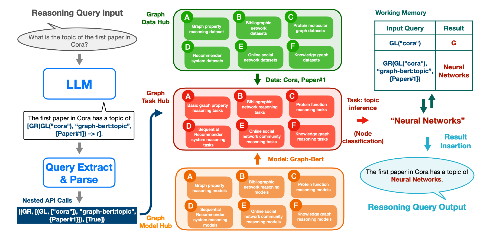

The source code of the graph-toolformer framework. The framework consists of several components listed as follows:

  - [x] add working memory module
  - [x] add query parser module
  - [x] add query excutor module
  - [x] add graph dataset hub
  - [x] add graph model hub
  - [x] add graph reasoning task hub
  - [x] add llm model hub
